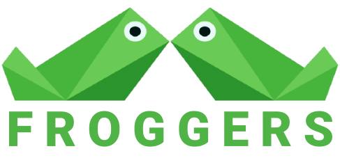

# Projeto de E-Commerce de produtos geeks, feito com HTML, css, Javascript e MySQL, utilizando scrum para maior eficiência na realização

  

## Tópicos 
[Sobre a Froggers](#sobre-o-froggers)

[Funcionalidades](#funcionalidades)

[Tecnologias e Ferramentas](#tecnologias-e-ferramentas)

[Banco de Dados](#modelo-relacional-do-banco-de-dados)

[Refercias](#refercias)

 

## Sobre o Froggers
Froggers é um projeto de e-commerce fantasia, realizado por 4 alunos da URI Campûs Santiago, com o intiuito de aprender mais sobre HTML, Javascript, PHP e Mysql.

## Funcionalidades

- [X] Cadastro de usuários.
- [X] Sistema de login.
- [X] Banco de dados MySQL.
- [X] Integração entre banco de dados e HTML com php
- [X] Realização de pedidos.
- [X] Carrinho de compras.
- [X] Buscar produtos.

 

## Tecnologias e Ferramentas

As seguintes tecnologias foram utilizadas no desenvolvimento do projeto:

- [HTML](https://devdocs.io/html/)
- [CSS](https://devdocs.io/css/)
- [PHP](https://devdocs.io/php/)
- [JavaScript](https://devdocs.io/javascript/)
- [MySQL](https://www.postgresql.org/)

 

## Modelo Relacional do Banco de Dados

  
   
  Modelo relacional que será usado como referência para o banco de dados

 

## Refercias

> O Projeto é baseado em um protótipo feito na plataforma Figma, em 2022 que pode ser visualizado [aqui](https://www.figma.com/proto/Zfx0EGkNO9BIIvuj7KcctE/Design-Site-de-Camisetas?node-id=17%3A6)

> Uma cópia de nosso quadro no trello pode ser visualizada [aqui](https://trello.com/invite/b/eDLva5wP/ATTI2df96e99c79d59e0330cb6cc16dfbcd984A02909/froggers-copia)

> Uma cópia de nosso artigo via google docs pode ser visualizado [aqui](https://docs.google.com/document/d/1nN44evdMG_xfkwE8CpBq1jCpd9qyIJgT-E4JfJZA8EY/edit?usp=sharing)

